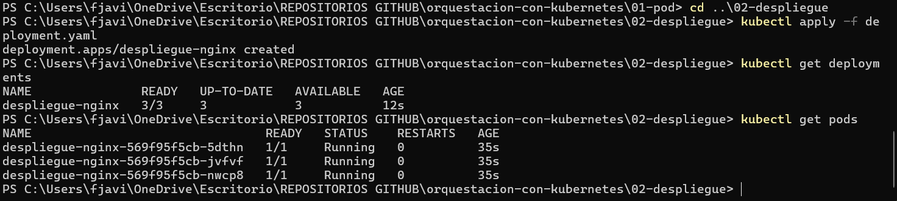
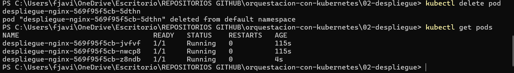
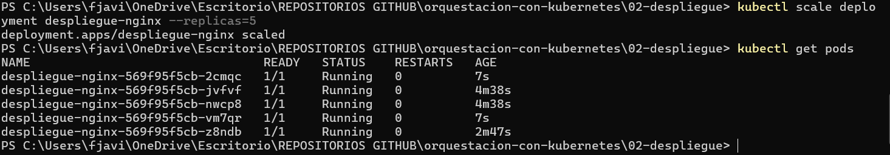
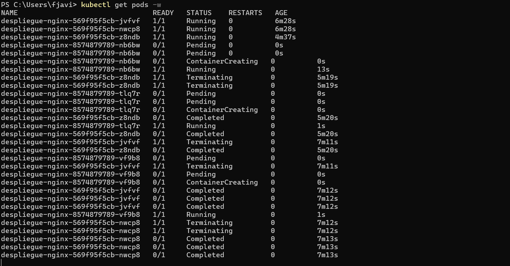

# 02 - Deployment
En este paso, creo un Deployment que se encargará de mantener los Pods en caso de que mueran. Esto es porque si creo un Pod suelto, si acabase muriendo por cualquier razón, el Deployment se encargaría de crear otro automáticamente gracias al autohealing.

En este ejercicio despliego 3 réplicas de nginx.

## ¿Cómo aplicarlo?

```bash
kubectl apply -f deployment.yaml
```


## Comprobar que funciona

```bash
kubectl get deployments
kubectl get pods
```



Deberían aparecer 3 pods con nombres generados automáticamente.

## El autohealing

Al borrar uno de los pods manualmente, el Deployment crea otro para mantener las 3 réplicas:

```bash
kubectl delete pod <nombre-del-pod>
kubectl get pods
```



## Para escalar el número de replicas

```bash
kubectl scale deployment despliegue-nginx --replicas=5
kubectl get pods
```



## Actualizar la imagen

Con el Deployment también consigo actualizar los pods de forma progresiva, sin downtime, es decir, sin cortar el servicio:

```bash
kubectl set image deployment/despliegue-nginx nginx=nginx:1.26
kubectl rollout status deployment/despliegue-nginx
```

## Para volver a la versión anterior

```bash
kubectl rollout undo deployment/despliegue-nginx
```

## Para eliminar el deployment

```bash
kubectl delete -f deployment.yaml
```
